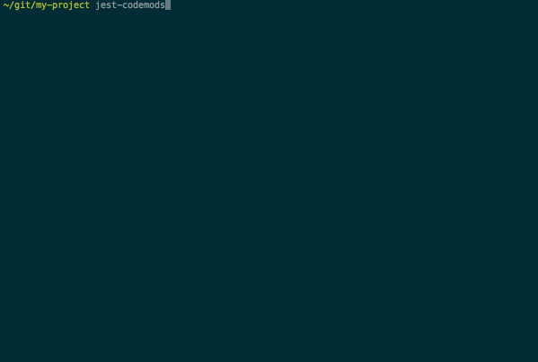

# jest-codemods

Codemods that simplify migrating JavaScript test files from
[Mocha](https://github.com/mochajs/mocha),
[Chai](https://github.com/chaijs/chai),
[Should.js](https://github.com/tj/should.js/),
[Expect@1.x.x](https://github.com/mjackson/expect),
[proxyquire](https://github.com/thlorenz/proxyquire),
[Tape](https://github.com/substack/tape)
and [AVA](https://github.com/avajs/ava)
to [Jest](https://facebook.github.io/jest/).



[](https://travis-ci.org/skovhus/jest-codemods)
[![version][version-badge]][package]
[![Tweet][twitter-badge]][twitter]

Codemods are small programs that help you automate changes to your codebase.
Think of them as search and replace on steroids.
They are executed by the [Facebook jscodeshift](https://github.com/facebook/jscodeshift) tool.

This tool is made for trying out Jest on your existing test files.
We strive to make the migration as smooth as possible, but some manual intervention
and tweaks to your tests are to be expected.


## Install

```
$ npm install -g jest-codemods
```

This installs the runner as `jest-codemods`.


## Usage (CLI)


To use the interactive CLI run

	$ jest-codemods


If you are using Flow types

	$ jest-codemods --parser flow


For more options
```
$ jest-codemods --help

    Codemods for migrating test files to Jest.

    Usage
      $ jest-codemods <path> [options]

    path	Files or directory to transform. Can be a glob like src/**.test.js

    Options
      --force, -f	Bypass Git safety checks and forcibly run codemods
      --dry, -d		Dry run (no changes are made to files)
      --parser		The parser to use for parsing your source files (babel | babylon | flow)  [babel]
```

To transform all test files in a directory run `jest-codemods test-folder` in your terminal.

Notice the console output for errors, manual intervention and tweaks might be required.


## Usage (jscodeshift)

To make the process as simple as possible, we recommend the `jest-codemods` CLI
that wraps the `jscodeshift` executable.
But you can also run the transformations directly using `jscodeshift`.

```
$ npm install -g jscodeshift
$ npm install jest-codemods
$ jscodeshift -t node_modules/jest-codemods/dist/transformers/ava.js test-folder
$ jscodeshift -t node_modules/jest-codemods/dist/transformers/chai-assert.js test-folder
$ jscodeshift -t node_modules/jest-codemods/dist/transformers/chai-should.js test-folder
$ jscodeshift -t node_modules/jest-codemods/dist/transformers/expect.js test-folder
$ jscodeshift -t node_modules/jest-codemods/dist/transformers/mocha.js test-folder
$ jscodeshift -t node_modules/jest-codemods/dist/transformers/should.js test-folder
$ jscodeshift -t node_modules/jest-codemods/dist/transformers/tape.js test-folder
```

## Test environment: node.js or browser

Normally Jest tests are running on node.js. But in some cases you might want to use execute
your tests in a browser. In that case you can select the environment using the
`jest-codemod` CLI.

After running `jest-codemods` you might need to install a few dependencies:

  yarn -D jest-matchers jest-mock


## Transformations

If possible `import` / `require` statements determine if any transformation are carried out.
The original code quoting style is preserved.
Warnings are made if packages are used that are incompatible with Jest.

Usage of `proxyquire` is replaced with Jest mocks.


#### Warnings for unsupported features

Warnings for unsupported AVA features:
 - `t.skip`

Warnings for unsupported Tape features:
 - `t.timeoutAfter`
 - `t.deepLooseEqual`
 - `t.looseEqual`
 - `t.looseEquals`
 - `t.notDeepLooseEqual`
 - `t.notLooseEqual`
 - `t.notLooseEquals`
 - `t.skip`
 - `test.createStream`
 - `test.onFinish`


## Inspiration

Thanks to [avajs/ava-codemods](https://github.com/avajs/ava-codemods) for inspiration and CLI setup.

The Mocha and Chai assert support began its life at [paularmstrong/mocha-to-jest-codemod](https://github.com/paularmstrong/mocha-to-jest-codemod).

Chai Should/Expect came from [AlexJuarez/chai-to-jasmine](https://github.com/AlexJuarez/chai-to-jasmine).


## Contributing

To get started, run:

	yarn

When developing:

	yarn run check  # (runs lint and unit test)
	yarn run lint
	yarn run test
	yarn run test:cov
	yarn run test:watch


## License

MIT

[version-badge]: https://img.shields.io/npm/v/jest-codemods.svg?style=flat-square
[package]: https://www.npmjs.com/package/jest-codemods
[twitter]: https://twitter.com/intent/tweet?text=Check%20out%20jest-codemods!%20https://github.com/skovhus/jest-codemods%20%F0%9F%91%8D
[twitter-badge]: https://img.shields.io/twitter/url/https/github.com/skovhus/jest-codemods.svg?style=social
